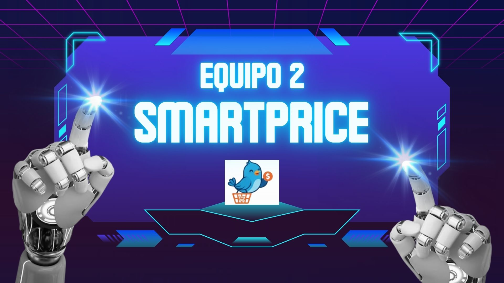

## 📘 SmartPrice 🛒

  

## Equipo 2 – Fundamentos de Ingeniería de Software

---

## 📝 Descripción General

Este repositorio contiene el desarrollo del proyecto **SmartPrice**, realizado por el **Equipo 2** como parte de la asignatura *Fundamentos de Ingeniería de Software*.
Aquí se documentan los entregables, avances, evidencias y artefactos producidos durante el proceso.

---

## 👥 Integrantes del Equipo 2
### Segunda Entrega – Prueba de Desempeño

| Integrante | Responsabilidad Principal |
| :---: | :---: |
| **Jhoana Pech**  | Coordinación y seguimiento del proceso |
| **Ana Angulo**  | Definición de objetivos y criterios |
| **Alejandra Aguilar**  | Diseño visual y prototipos |
| **Kevin Morales**  | Requerimientos técnicos y calidad |
| **Bianca Ramos**  | Análisis funcional y desarrollo |
| **Emilio Arellano**  | Gestión del backlog y prioridades |
| **José Correa**  | Control de calidad y coherencia |

---

## 📁 Estructura del Repositorio

A continuación se presenta un resumen de cada carpeta y los documentos incluidos.

| Carpeta | Descripción |
|---------|-------------|
| [**Competencias**](https://github.com/jhoanapechram/-FIS-Equipo-2/tree/capiiim-patch-2/3ra%20Entrega/Competencias) | Documenta las competencias genéricas y específicas desarrolladas, así como retroalimentación interna del equipo. |
| [**Diseño**](https://github.com/jhoanapechram/-FIS-Equipo-2/tree/capiiim-patch-2/3ra%20Entrega/Dise%C3%B1o) | Contiene los cambios del prototipo, la correspondencia entre requerimientos y pantallas, y la guía de diseño del sistema. |
| [**Presentación del avance**](https://github.com/jhoanapechram/-FIS-Equipo-2/tree/capiiim-patch-2/3ra%20Entrega/Presentaci%C3%B3n%20del%20avance) | Carpeta destinada a almacenar los recursos utilizados para la presentación correspondiente a esta tercera entrega. |
| [**Proceso**](https://github.com/jhoanapechram/-FIS-Equipo-2/tree/capiiim-patch-2/3ra%20Entrega/Proceso) | Reúne la documentación del proceso de trabajo, así como todas las bitácoras de sprints e individuales. 
| [**Producto**](https://github.com/jhoanapechram/-FIS-Equipo-2/tree/capiiim-patch-2/3ra%20Entrega/Producto) | Contiene la documentación del producto, su evolución, aspectos de innovación y perfiles de usuarios. |
| [**Pruebas**](https://github.com/jhoanapechram/-FIS-Equipo-2/tree/capiiim-patch-2/3ra%20Entrega/Pruebas  ) | Incluye los resultados y conclusiones derivados de pruebas formales, informales y con la herramienta Useberry. |
| [**Requisitos**](https://github.com/jhoanapechram/-FIS-Equipo-2/tree/capiiim-patch-2/3ra%20Entrega/Requisitos) | Documentación relacionada con casos de uso, historias de usuario, priorización y lista final de requerimientos. |

---

---

## 📌 Objetivos del Proyecto

*Desarrollar una plataforma que permita **comparar precios** de productos en supermercados para **optimizar la toma de decisiones** del consumidor, mediante una interfaz accesible, actualizada y centrada en el usuario.*

---

## 📬 Contacto

Para dudas o seguimiento, contactar al equipo mediante la sección de *Issues* del repositorio o vía correo institucional.

---

  <b>Gracias por visitar nuestro proyecto SmartPrice 💡</b>

